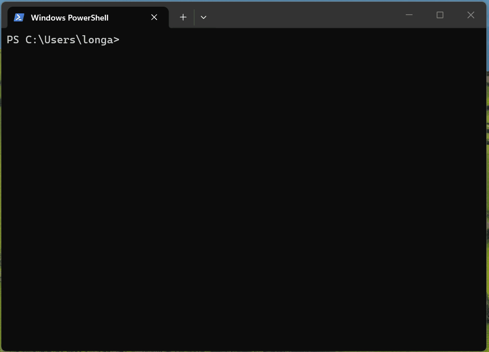
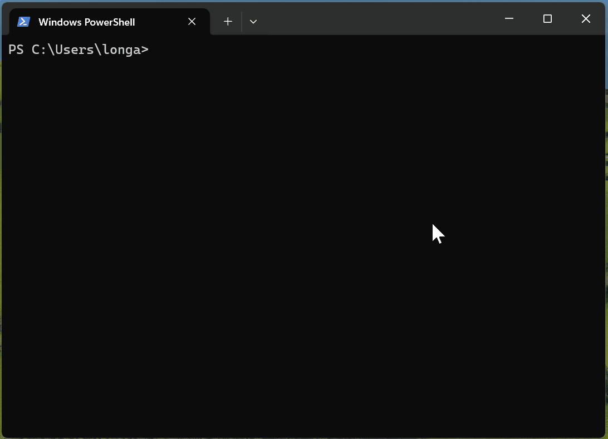

# Jotbook

**English** · [简体中文](README.zh-CN.md)

[](https://github.com/Longao5k/jotbook/actions/workflows/ci.yml)
[](LICENSE)

A notebook for the commands **you** actually use. Hit one key, the command lands on your prompt — you press Enter.



## Why

Not *"I don't know how to write this command"* — AI already solved that.

It's *"I know it, I used it last week, and I don't want to scroll through my chat history again."*
That's a **retrieval** problem, not a generation problem. And `sudo systemctl restart kestrel-orders-api.service`
— the exact command for *your* box — was never something a nondeterministic model should be regenerating.

## Features

- **Bilingual** — interface and built-in notebooks in English or Chinese, switched together with `jot lang`
- **Not empty on day one** — 19 notebooks, 630+ commands built in:
  git · linux · macos · powershell · ssh · tmux · docker · kubectl · nginx · systemd · dotnet · flutter · npm · python · mssql · mysql · postgres · redis
- **Learns what you use** — frequently and recently used entries float to the top. With an empty search box the list is simply your most-used commands
- **Variables** — `{{service}}` can come from your profile, from a live command's output, or just ask you
- **Injects, never executes** — jot puts the command on your prompt and stops there. You press Enter
- **Plain text** — everything is Markdown. Sync with git, read it on GitHub, edit it in vim
- **No account, no server, no telemetry**
- **First-class on Windows** — bundled fuzzy matcher and TUI, no fzf dependency

## Install

Grab a binary from [Releases](https://github.com/Longao5k/jotbook/releases) — Windows, Linux, and both Mac architectures — and put `jot` on your `PATH`.

Or build it, which needs [Rust](https://rustup.rs):

```bash
cargo install --git https://github.com/Longao5k/jotbook jot-cli
```

Then wire up your shell. One line — the script itself ships with the binary, so upgrades never require touching your config again.

<details open>
<summary><b>PowerShell</b></summary>

```powershell
Add-Content $PROFILE "`njot init powershell | Out-String | Invoke-Expression"
```
</details>

<details>
<summary><b>bash</b></summary>

```bash
echo 'eval "$(jot init bash)"' >> ~/.bashrc
```
</details>

<details>
<summary><b>zsh</b></summary>

```bash
echo 'eval "$(jot init zsh)"' >> ~/.zshrc
```
</details>

<details>
<summary><b>fish</b></summary>

```bash
echo 'jot init fish | source' >> ~/.config/fish/config.fish
```
</details>

Restart your shell, then press **<kbd>Ctrl</kbd>+<kbd>J</kbd>** (PowerShell) or **<kbd>Ctrl</kbd>+<kbd>G</kbd>** (bash / zsh / fish).

> Different keys on purpose: `Ctrl`+`J` is LF in a terminal, which readline treats as Enter — binding it there would break newlines. PSReadLine gets a distinct key event, so it's safe. Override with `jot init bash --key '\C-o'`.

## Getting started

```bash
jot import history --top 40                              # pull your most-used commands out of shell history
jot profile set service kestrel-orders-api.service   # your environment's constants
jot                                                      # go
```

## Commands

| Command | What it does |
|---|---|
| `jot` | Open the picker |
| `jot docker logs` | Open it with a search term |
| `jot save` | Save the command you just ran |
| `jot save "<command>"` | Save a specific command |
| `jot import history` | Bulk import from shell history, ranked by frequency |
| `jot import text` | Import commands pasted from anywhere - the clipboard by default |
| `jot import text -n <name>` | ...into a notebook of your choosing |
| `jot ls` | List every entry |
| `jot notebooks` | List the notebooks and the `@name` to filter by |
| `jot edit [notebook]` | Open in `$EDITOR`, on the line the command sits on |
| `jot rm [words]` | Delete one of your own entries |
| `jot new <name>` | Create a notebook |
| `jot use <profile>` | Switch profile |
| `jot profile set <k> <v>` | Set a profile variable |
| `jot add gh:user/repo` | Install a community notebook source (a git repo) |
| `jot sources` | List installed sources |
| `jot sync [name]` | Update sources |
| `jot trust <name>` | Let a source's `from: shell` variables actually run |
| `jot remove <name>` | Uninstall a source |
| `jot lang [en\|zh\|auto]` | Show or set the interface and notebook language |
| `jot doctor` | Self-check |
| `jot path` | Print the data directory |
| `jot pick -q "<term>" --first` | No UI, best match straight to stdout (for scripts) |


### Keys

| Key | |
|---|---|
| <kbd>↑</kbd> <kbd>↓</kbd> | Move |
| <kbd>Enter</kbd> | Use the selected entry |
| <kbd>Ctrl</kbd>+<kbd>B</kbd> | Back one screen, while filling in variables |
| <kbd>Esc</kbd> | Quit, wherever you are |
| <kbd>Ctrl</kbd>+<kbd>E</kbd> | Open the entry in `$EDITOR` |
| `@notebook` `#tag` | Narrow the list, typed into the search box |

## Writing notebooks

`jot new` makes one, `jot save` asks which one to put a command in, and `@name` in the picker narrows to it:



A notebook is plain Markdown. `##` headings are entry names, the paragraph under one is the description, the code block is the command.

````markdown
---
name: my-servers
description: My boxes
vars:
  service:
    desc: systemd unit
    from: profile          # use the profile value; fall back to asking if unset
    cmd: systemctl list-units --type=service --no-legend --plain | awk '{print $1}'
---

## Restart the API

Required after changing appsettings. Not required for nginx config.

```sh @platform=linux @confirm @tags=deploy
sudo systemctl restart {{service}}
```
````

### Code block attributes

| Attribute | Effect |
|---|---|
| `@platform=` | `windows` / `linux` / `macos`, comma separated. Other platforms' entries are hidden |
| `@confirm` | Dangerous. Extra confirmation before injecting, marked ⚠ in the list |
| `@remote` | Meant for use after `ssh`. Disables this entry's dynamic variables, since they'd evaluate **locally** |
| `@tags=` | Extra search keywords |

### Narrowing the picker

Six hundred entries is a lot to scroll. Two prefixes scope the search:

| Typing | Shows |
|---|---|
| `@docker` | only the docker notebook |
| `#deploy` | only entries tagged deploy |
| `@docker logs` | scope and search term together |

`jot notebooks` lists the names available. Everything must match, so
`@git #undo reset` narrows three ways at once.

### Variables

| Source | Behavior |
|---|---|
| `ask` (default) | Prompts you. Add `options` for a fixed list |
| `profile` | Taken from the active profile without interrupting you; falls back if unset |
| `shell` | Runs `cmd`, turns the output into a searchable candidate list |

An **undeclared** `{{name}}` also checks the active profile first. That's what makes `jot save`'s auto-parameterization work end to end — it rewrites the value into `{{service}}` without adding a declaration, and the result still resolves. Write `from: ask` explicitly when you always want to be prompted.

Built-ins: `{{@cwd}}` `{{@date}}` `{{@host}}` `{{@git.branch}}` `{{@git.root}}` `{{@env.NAME}}`
Inline defaults: `{{port=8080}}`

**Go templates work as-is.** `{{ }}` collides with Docker and kubectl, so jot only treats *plain identifiers* as variables:

```sh
docker ps --format "{{.Names}}\t{{.Status}}"       # literal — no escaping needed
kubectl get x -o go-template='{{range .items}}…'   # literal
sudo systemctl restart {{service}}                  # this one is a variable
```

For a literal `{{name}}`, write `\{{name}}`.

## Community notebooks

A source is just a git repo. jot shells out to `git`, so private repos, SSH keys, and incremental updates all work with no extra setup.

```bash
jot add gh:someone/jot-notebooks
```

jot looks for a `notebooks/` directory, falling back to `*.md` at the repo root (README, LICENSE and friends are skipped). Sources live in `~/.jot/notebooks/sources/<name>/` — you can also just `git clone` into that directory yourself.

**Sources are untrusted by default.** A notebook's `from: shell` variable runs an arbitrary command on your machine just to *populate a list* — merely browsing a hostile notebook would be enough. So for anything outside `builtin/` and `local/`, dynamic variables are disabled until you read the notebook and opt in:

```bash
jot trust someone-jot-notebooks
```

Everything else about an untrusted source works normally. And the command itself is still only ever *typed onto your prompt*, never executed.

## Language

jot speaks English and Chinese. Both the interface and the built-in notebooks
switch together, so the entry titles and descriptions are in whichever language
you read.

```bash
jot lang zh
```

The choice resolves in this order: an explicit `jot lang` setting, then
`JOT_LANG` or your usual locale variables, then the OS locale, then English.
`jot lang auto` hands control back to the environment.

The commands themselves are identical in both languages, and a test enforces
that: only the prose differs. Notebooks live under `notebooks/en/` and
`notebooks/zh/` in this repository, and only the active language is written to
`~/.jot/notebooks/builtin/`.

## Where things live

```
~/.jot/
├── notebooks/
│   ├── builtin/     shipped with the binary, in your language; rewritten on upgrade
│   ├── local/       yours; never touched
│   └── sources/     community sources (git clones); untrusted by default
├── config.toml      active profile
├── profiles.toml    your environment's constants — not for secrets
└── usage.toml       how often you use each entry, for ranking
```

`notebooks/` is a plain directory — `git init` it and you have sync, history, and sharing. `profiles.toml` deliberately sits outside it.

## Contributing

Notebooks are the most valuable thing you can send. A PR adding commands to `notebooks/en/*.md` needs no Rust at all — just Markdown that follows the format above. Add the matching entry to `notebooks/zh/*.md` if you can; a test checks that both languages stay structurally identical. Commands that people genuinely can't remember are worth more than exhaustive coverage of `--help`.

For the client itself, see [docs/design.html](docs/design.html) for architecture, decision records, and non-goals before opening a large PR.

### Building

```bash
cargo test
cargo build --release
```

On Windows, use the MSVC toolchain — the GNU host needs a full MinGW install because `dlltool` shells out to `as`:

```bash
rustup default stable-x86_64-pc-windows-msvc
```

## License

MIT
